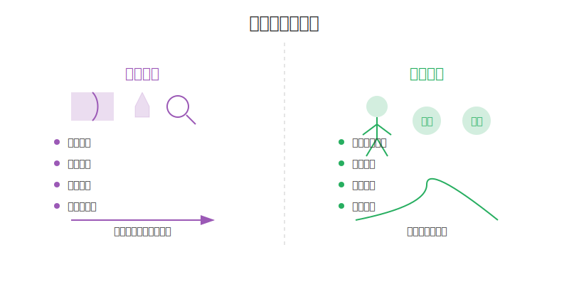
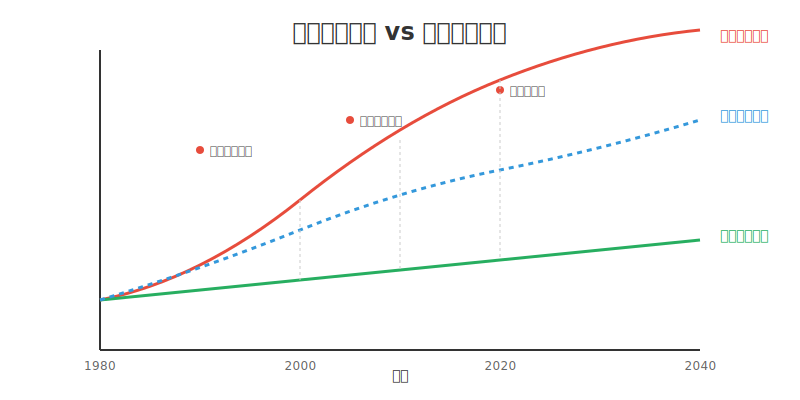

# 第一章 提升學習的關鍵能力到底是什麼？

打造超人學習這本書，其實並不是非常好寫。

原因是，「學習」本身是一個非常大的議題。影響這件事結果的變因也非常多。

所以，當我在寫作這本書時，雖然能夠寫作的素材非常多，但從哪個角度切入安排順序。也讓我夠傷透腦筋。

能夠出版的最後這一版，足足是重寫了三四遍的成果，反覆調整才找到最適當的安排。

## 學習到底是什麼？以及為什麼我們對這件事又愛又恨？

「學習」一方面是我們日常每分鐘都會使用的技能。

但談到「學習」，我們對這件事的感覺又總是浮上一股複雜的感覺。

我們知道「學習」最終會帶給我們好處。但一方面我們又痛恨當中的過程、以及通過消耗時間但最後成果輸出卻非常不穩定的情形。

最終，幾乎絕大多數人選擇了「逃避」這個選項。

這也造成了「學習」這個行為，雖然佔了我們人生很大部分的時間。但相對來說許多人卻只花了極少心力去有組織的正面解決這個問題。

其實我們也不是不想。而是談起提升學習能力這件事，有時候就很像是一睹黏糊的厚牆。我們用盡全力想擊破的結果，不是拳頭深陷在裡面搞得狼狽不堪，就是這堵牆好似晃了一下，又好端端的站在原地。

卡在我們想要到達境界的道路正中間，讓我們既是噁心又是心力交瘁。

### 我們弄混了「自然學習」以及「刻意學習」

為什麼會有情形出現？我想先來談談什麼是學習。

根據維基百科的定義，學習分為狹義與廣義兩種：

- 狹義：通過閱讀、聽講、研究、觀察、理解、探索、實驗、實踐等手段獲得知識或技能的過程，是一種使個體可以得到持續變化（知識和技能，方法與過程，情感與價值的改善和升華）的行為方式。例如通過學校教育獲得知識的過程。
- 廣義：是人在生活過程中，通過獲得經驗而產生的行為或行為潛能的相對持久的行為方式。

廣義來說。我們無時無刻都在「不斷的從外界下載經驗」，這也是所謂「自然學習」。我們人天生就有這種能力。看了旁人的示範，立刻有辦法模仿操作。透過跌了一跤，學到這條路上有個坑洞，下次走路務必小心。

這樣的升級結果，讓我們對於各種執行結果，掌握更多確定性。對於下次執行同樣一件事時，能夠提升更多效率。更別說在攻克難題時，那種瞬間的喜悅。

所以我們天生其實挺熱愛學習。

但是，為什麼我們又討厭學習。

可以抱怨的事實在太多了：

- 有時候在 A 領域 work 的經驗，拿到 B 領域卻頭破血流
- 有時候用盡全力，卻一無所獲
- 上課的過程實在太痛苦了，很像受針刑
- 要解一個問題，卻被書山淹沒，搞了老半天，不知道解答到底在哪裡。
- 花了很多時間看的東西，瞬間又忘掉了
- ....

這個列表，繼續展開下去，再寫幾十行沒問題。

但關鍵是，為什麼對於同一件事，我們對它可以又是愛又是恨？

因為，真要說起來。這其實是兩件事。

- 喜歡：你喜歡的是自然學習的過程與結果
- 討厭：你討厭的是刻意學習的過程與結果

我們之所以被覺得這是同樣一件事。是因為我們的人生，本來就具有自然學習的能力。在經過一段短暫自由的快樂學習時光（1-6 歲）後。迅速被推進一個錯誤的地獄學習環境（6-18歲國民教育）裡面，下載一些似是而非的學習方法。而我們被這些亂七八糟的方法折磨洗腦後。誤以為這些方法也是正確的學習方法。最後產生將兩者的方法、感覺混在一起的結果。

於是最後才出現「自然」學習時很開心，但「刻意」使用這些「學習方法」時很痛苦。

所以，我們之所以對「學習」這個議題滋味複雜。其實就是因為在這個領域裡面，兩種「目的」不同的解法、結果、情感被混淆了。不知道使用的時候，什麼是正確的，什麼是錯誤的。更糟糕的是，你覺得還會覺得出現薛丁格的現象，也就是過程與結果都是不確定的。

所以，社會上多數人，對於學習這個字，甚至會有 PTSD（創傷症候群）。聽到這兩個字，就覺得恐懼，下意識關閉通往「學習」的路。

## 人類一直用錯誤的攻略在玩新的遊戲

若將這兩種感覺分開討論之後，你會發現身為人類，自然學習的能力並沒有壞掉。因為那本來就是我們與生俱來的能力。我們日常生活中，時刻針對產生的結果修正自己先前的行為，已取得不變的結果，這種能力就是「自然學習」。

但是，若談到「刻意學習」。可以說每個人都用的相當吃力，只要題目大一點，過程都是痛苦不堪的且結果都是歪七扭八的。

理論上，如果我們不碰觸「刻意學習」這個主題，人生就能開開心心的。這本書，也就寫到這裡就可以結束了。（咦）

但實際上，我們卻無法逃避。這在過去的一兩百年間，更是如此。在此前，多數人類過的一直是平穩的農耕狩獵生活，環境沒有什麼太大改變。因此，即便「刻意學習」的能力不行，光靠著內建的「自然學習」，也能過上一生。

但是，在過去一兩百年間，世界的改變是巨大的。光從個人電腦開始流行，再到家家可以上網，再到現在大家用手機完成各樣事情，也就只花了三四十年的時間。科技的進步速度，遠超過人類正常自然學習的速度。

我們人類，向來就是透過不斷的自然學習去適應周遭的環境。但是現在周遭環境的改變速度，卻快到如果我們若不經過一點「刻意學習」，甚至會到了無法存活，甚至會很快被淘汰的態度。嚴重的話，甚至生活寸步難行（舉例，手機支付與掃碼通關）

不同領域的生產力在自動工具的輔助下，社會效率變得越來越高。也有越來越多的新方法與流程被發明出來。

也因此，「刻意學習」在跟上社會變遷的道路上，變的非常重要。

這也是為什麼我們的社會創造了一個「教育系統」，在「刻意訓練」我們「刻意練習」的能力。

但坦白說，但這個系統，對我們克服時代變遷有幫助嗎？

按照最後的實際產出，我想按照社會上每個人對於「學習」這件事的評價與結果，我想是「沒有用」的。更甚至來說，很有害。

### 錯誤的模型讓人類一直在使用錯誤的策略解題，甚至最後還產生錯誤心態

理論上，我們的學校是為了增加學生「刻意學習」的成果所存在的。

整個學校教育的成立原因，是為了模擬一個相對較安全的環境，讓學生在此環境下，學習未來出社會會使用到的知識與方法，讓整個社會能夠接收一批高質量、有學習方法、能夠跟上社會變遷的成人。

不過，理念上說是這樣。執行成果卻不是這樣。甚至還變成了嚴重反效果。

怎麼說呢？我畫個表格你就知道問題在哪裡了。

貼出這個表格，可能會讓讀者瞬間很驚嚇。

挖操，好像發現了什麼新大陸。

其實，光貼出這張圖，這本書寫到這裡，好像又可以收工了。（咦）

我們之所以對學習有深深痛苦的印象。且非常不適應從學校畢業以後的職場生活、覺得自己能力很低、從此自己沒有更新的能力。其實都是因為學校害的。

理論上學校的設計，是因為我們想要讓年輕的下一代具備刻意學習的能力。實際上卻讓他們學習了一套錯誤的方法，進而毀滅了他們對於學習的意願以及能力。

這套結構，從宏觀來說，本質上是假設了一個靜態不會變的世界，讓參加者追求在裡面練習到試卷滿分。並且追求平均的多角發展。

但是，我們在成人社會裡面，卻面對的卻不是這樣的環境與挑戰。在社會裡面生存需要的能力，是面對未知的環境，迅速找到思路開發出解法，而對於成就標準的衡量，在某一單科壓倒性的登峰造極。

學校教育覆蓋了人類的精華時光前12-16年，年輕人類進入這個系統時，多是白紙一張，還保有一定水準的學習能力。我們關於學習的印象、方法、比較成就的標準、設立目標的方法、對於解法的設計手段，都是從學校來的。

但在經過這麼多年的鍛鍊之後，許多人進入社會後，卻不覺得「學校」幫我們預備好了。而是反而覺得自己學的東西怎麼一瞬間都沒有用。

而經過這麼多年的荼毒，許多畢業生甚至連續自然學習的意願都被屏蔽，並且相信自己甚至也失去了更新能力。

### 改用全新且正確的思維去玩遊戲

我相信，本書讀者應該都玩過許多不同種類的遊戲。應該粗淺的知道不同種遊戲，應該使用不同的策略去遊玩、破關。

比如說用在回合建造類的思維就沒辦法用在即時戰略類型的。這兩種遊戲中當中雖然有些許相同的個別建造元素，但組合起來本質上是根本不同類型的遊戲。

如果用錯遊戲方法，通常就會很難通關，或甚至提前陣亡。

學習這個領域，也是如此。

在學習界，有這麼多詭異的現象，本質來說，其實是因為我們一直拿 A 遊戲的攻略在打 B 遊戲！那麼遊戲過程很慘烈、過程事倍功半、最後也沒有成果，自然也是正常的。

回到本章的原點，所以提升學習動機的關鍵是什麼呢？

我認為是要先認識到，學校模擬的與社會需要的，其實是不同的兩種遊戲。

一旦先認識到自己在什麼遊戲當中。就已經是成功的 50% 了。

因為人類本身自然就會因為目標的不同，而切換不同的實施手段。

所以，當你能清醒的意識到這是兩場不同的遊戲時，遊戲的規則又截然不同時，自然就會對新的玩法有所接受，甚至主動探索有效方法。

我想讀者在讀這本書時，剛開始會很糾結，如果我們現在要學新方法。那舊的方法要怎麼辦？

別擔心，

* 首先我們原先在學校學的那套方法，實在太破了也沒什麼用，扔掉也沒什麼可惜的
* 再來，其實我在本書裡面教的方法，幾乎都會是人類自然舊有的。這本書只是教你「正確」的排列組合，從而使出強大的威力而已

這本書在第一遍讀起來雖然會讓你有點震撼且吃力。但我向你保證，只要你花兩三個小時看完這本書，絕對能開始產生上面我所宣稱的效果，而且是立即性的改變。

## RPG 遊戲 V.S. 記憶填空遊戲

那麼。我們又要如何邁出第一步呢？

首先，你已經知道我們要玩的是一個新遊戲。這就已經足夠改變很多事了。

第二，我們的人生，本質上就是一場「RPG」遊戲。你只是在地球這個伺服器，扮演你自己而已。我們是在玩角色扮演的遊戲，而不是在玩一個超大的「填空記憶遊戲」。

你原本可能會覺得扔掉舊方法很可惜。

但是新遊戲規則是這樣的：

- 只要專攻一個喜歡又擅長的項目，最短時間拿到最高分
- 什麼奇怪手段都能用，法律上沒有明文禁止的行為你都可以做
- 越熟練 exp 會指數型暴增，速度是別人的 2 倍，回報就是別人的 4 倍。速度是別人的 3 倍，回報就是別人的 9 倍。以此類推，指數型給分。
- 成就的標準不是完美複製得到 100 分少扣分扣一下。而是鼓勵瘋狂嘗試下一輪，越來越好，瘋狂疊 buff 到 10000 分。
- 高分就有錢，有名聲，更有成就

回頭一看，你是不是會發現發現舊玩法與戰略：

- 喜歡的學科被禁止學過頭，要花上大量的時間去學「自己不擅長的」
- 背一堆自己覺得無趣的東西。想盡辦法背誦 100 分。
- 不要犯錯，盡量不嘗試新的就不扣分

扔掉其實也沒什麼可惜？

第三，也因為這是一個 RPG 遊戲。RPG 遊戲裡面，本身就有非常多的「小遊戲」作為遊戲的關卡。

些小遊戲本身會有很多種不同的類型，這當中裡面一定也包含重複打怪、有記憶填空。

這本書其實不是說強迫你扔掉「所有」的舊玩法，我們只是在幫你掙脫過去舊的錯誤設定而已。所有的技能等級，還是可以重新保留。只是從今往後的升級速度，變為原來的一百倍而已。
