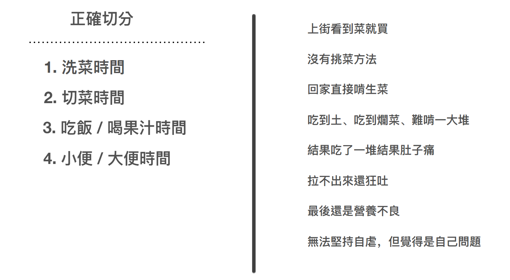
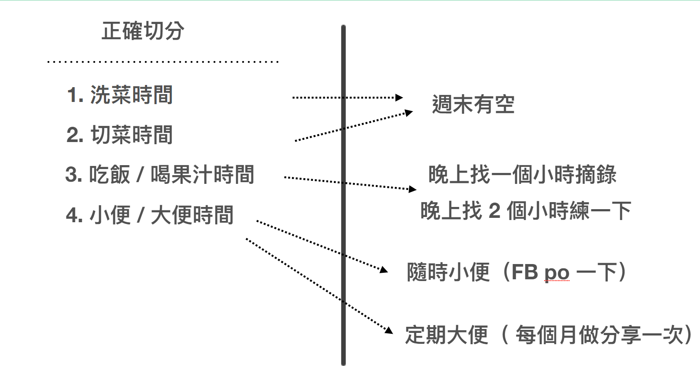
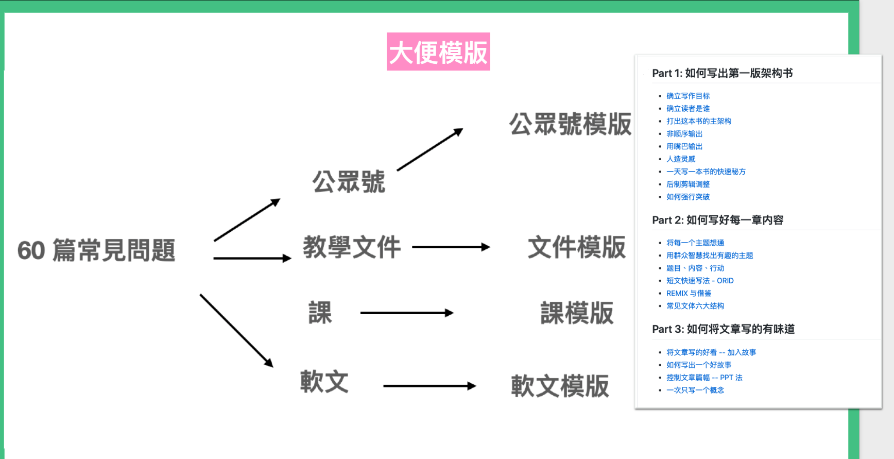

# 讀書篇(4) 有效率利用碎片時間吸收書本資訊

前面我們講了這麼多方法。但是始終沒有解決一個問題，哪來的時間呢？

對阿，這套方法看起來貌似很有效。但身為一個上班族，更實際的是，我們哪抽的出來時間做這一套大系統呢？

光第一層篩書，可能就做不到了。

如果你有這個想法的話，其實就代表你的切入思維錯了。

我們都以為，好好讀一本書，需要抽出大塊時間。

但其實，讀書，從來就不是一個動作，而是四個動作。你需要切出四種不同的時間。

1. 洗菜時間
2. 切菜時間
3. 吃飯 / 喝果汁時間
4. 小便 / 大便時間

那我們什麼時候做這些事呢？

關於洗菜、切菜。你可以趁週末有空的時候，整理剛買進來的書（不管是電子化或者只是隨手翻一翻）。這需要比較悠閒的心態，你可以這件事，看做是整理書櫃這種家事，就會比較輕鬆愉快。

而吃飯、喝果汁呢。就可以挑比較有閒的下班後的一個晚上，花一個小時摘錄金句。

而通常摘完一兩本的金句之後，而神奇的大腦，可能就會在過幾天，自己神奇的湧現歸納一些新想法。這時候你就可以發 FB。這種時刻我稱為小便時刻。想法湧現時隨時就 PO出來。（隨地小便）

你也不用擔心隨時ＰＯ沒時間整理。可以乾脆等週末的洗菜時間再一起收納就好。

而大便呢，也不用強求，我認為大便還是需要一些技術的。你可以等小便蒐集多一點，自然就能積成一陀大便。

但重點是一定要進行小便、大便的動作。能排泄出來，才能算是真正有吸收進去。而且通常如果你能夠大出來，就表示你已經把這件事記得比一般人牢固很多了。

### 小便、大便的技術

有些讀者看到這裡，可能會有一點擔心，小便與大便需要門檻。其實，真要說的話，我覺得小便門檻其實是非常低的。

a) 小便

關於小便。你可以使用一種　ＯＲＩＤ　的模式。

這其實也是我們人類觀察一件事、反思、吸收經驗、最後行動的一種模式。任何人隨時都可以做得出來。

#### 1.　O-“Objective”：觀察外在客觀、事實。了解客觀事實的問句如下：

* 看到了什麼？
* 記得什麼？
* 發生了什麼事？

#### 2.　R-“Reflective”：重視內在感受、反應。喚起情緒與感受的問句如下：

* 有什麼地方讓你很感動/驚訝/難過/開心？
* 什麼是你覺得比較困難/容易/處理的？
* 令你覺得印象深刻的地方？

#### 3.　I-“Interpretive”：詮釋意義、價值、經驗。尋找前述意義與價值的問句如下：

* 為什麼這些讓你很感動/驚訝/難過/開心？
* 引發你想到了什麼？有什麼重要的領悟嗎？
* 對你而言，重要的意義是什麼？學到了什麼？

#### 4.　D-“Decisional”：找出決定、行動。找出決議和行動的問句如下：

* 有什麼我們可以改變的地方？
* 接下來的行動/計劃會是什麼？
* 還需要什麼資源或支持才能完成目標？
* 未來你要如何應用？

b) 大便

而大便，我得承認這件事的確是就有一點門檻的。但我認為你平常也可以存一點小便與模版方便輸出。

比如說我平常甚至就會有文件模版、課程模版，甚至還有寫書模版。這就是為什麼我會有這麼變態的寫作能力，甚至能有一兩天就寫成一本書的功力。

因為大便的確是需要功力的！大腸也是需要被鍛鍊的阿！

再不濟，你至少也要練成能夠寫一份演講投影片（甚至不需要實際演講）的功力吧！

許多人都以為讀書完發表感想（小便）、甚至做一份投影片（大便），是困難的。這實際上是大家不知道這些動作都是要被分開做的。

即使超強消化系統如我，也是很難做到讀完書馬上輸出大便的！

甚至很多人吃完東西，不用說大小便了，大腦甚至是會直接吐掉的。這也難怪乎大家老是抱怨學了以後很快就忘。何況用起來。

這實際是你沒有被鍛鍊過「讀書腸胃」！不知道如何使用自己的消化系統進食、攝取營養。

不過這也沒有關係！因為 99.99% 的人類也不會這個方法，甚至不知道要這樣做。你只要知道這套小便、大便方法，就已經贏過幾億人了。
