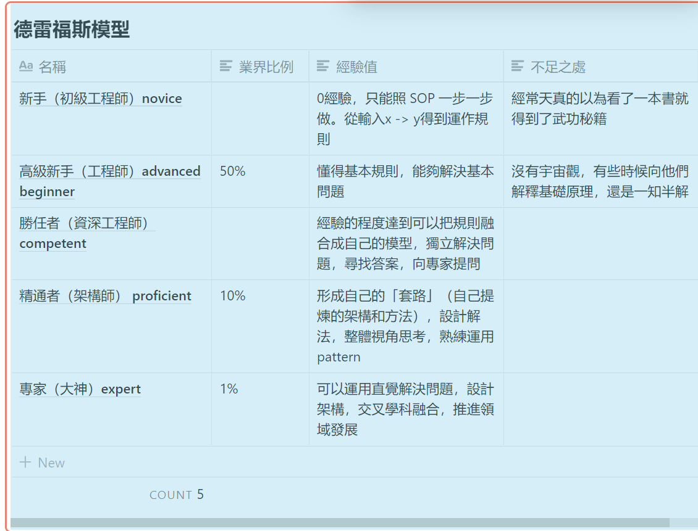
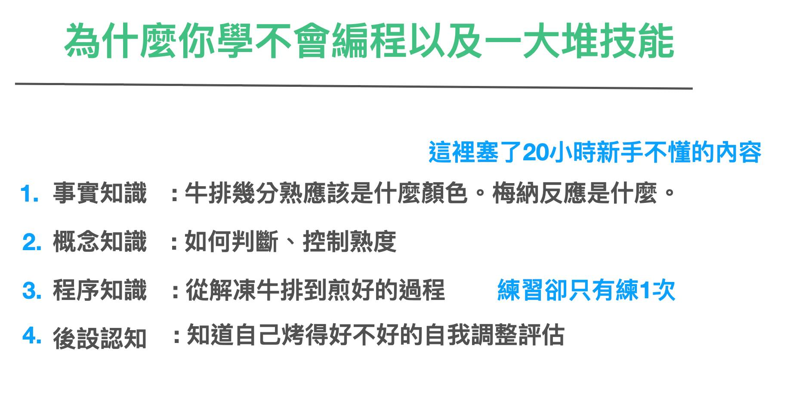

# 上課篇(1) 如何省力向老師學習

學習通常分為兩個方向，一個方向是自學（看書），一個方向是上課老師學習。

跟老師學習其實通常是比較快的學習方方式。這是因為人類自帶動作複製的鏡相神經元功能，看過一次通常就能模擬做出。有時候看好幾本書的效果，都不如親眼看大師示範一次。

雖然跟購買課程，跟老師上課學習速度較快。但是這其實也不太是出社會大家會選擇的一條路。這有幾個原因：

- 上課課程費用太貴了
- 自己聽不懂浪費錢
- 一些很簡單的東西講很久，真正重要的東西卻草草帶過
- 有時候課程很浪費時間（出社會後，自己的休息時間很少，能做作業的時間更少）
- 有的老師教得很好，有的教得超爛，上到一半就想睡著
- 老師教得爛也還是一樣不能走。重演上學時的惡夢。

我們又可以把這些抱怨整理成

- 浪費時間、浪費錢
- 聽不懂，學不會，記不住
- 老師爛，老師程度太高但我聽不懂

這其實背後又有幾個可能

- 老師不懂怎麼教讓你學起來比較省力
- 老師只會專業知識，不懂「教學」
- 課程與你的程度匹配不上
- 上課老師用講的很耗你的注意力，你聽了前面忘記後面的
- 上課累，想睡。下課累，沒時間練。

我們要如何閃開這些雷呢？

## Step 1:  分辨出你學習的對象是老師、前輩還是高級新手

在「向老師」學習的這個領域裡。最大坑的就是挑選老師了。因為在「向老師學習」學習的過程中，我們通常是採「被動學習法」，也就是老師教什麼，我們就學什麼。

所以，如果你上課的老師是大師，他可以讓你上天堂。你上課的老師是不好的老師，下場通常不只是住套房而已，而是當場讓你從興致勃勃的入門到瞬間放棄。

但是，初學者就是對於這個領域不熟悉的人。那我們要如何有辦法挑出相對比較好的老師呢？

這當中有一個觀念。就是不是所有比你厲害的人，都是老師。它們也有可能只是前輩而已。

我們可以把比你厲害的人分為幾種等級：

- LV 1 只是比你經驗還多的人
- LV 2 有自己獨特做事方法的人
- LV 3 能夠 1 對 1 教人做事方法的人
- LV 4 能夠 1 對 多教方法的人
- Lv 5 能夠 1 對多，還能學成率超高的人
- LV 6 精通領域技術也精通教學方法的人

通常 LV 4-6 可以稱之為老師。LV1-3 的只能稱之為前輩而已。

當我們將「老師」也分級出來，學習踩坑的機會可能就會少一些。為什麼我會這樣說呢？

前面我們有談到了一章德雷夫斯模型。

我們通常會把比你經驗值還多的人都以為是老師。事實上一個領域裡面充斥著大量高級新手。這些人只是剛學會基礎流程與基礎知識而已。因為它們只懂得非常少的皮毛，程度通常只能有辦法處理基礎問題。

- 不知道有捷徑、不相信有捷徑
- 不知道有套路、也不相信有套路

如果你向「高級新手」學功夫。這就慘了。它們一律會跟你說學習是很辛苦的，沒有捷徑，而且要從「基礎」學起，否則容易翻車。

聽到這件事你會有點吃驚，不是每個領域「大家」都說要從基礎學起嗎？

這是因為「大家」這個詞，是一個數學問題。當整個領域的 50% 以上都是高級新手時，依照大數法則。我們自然以為「聲音大」「出現多次」的就是對的。

你想想看精通者+專家，比例也才 11%。它們甚至懶得上網反駁那些智障言論。

我曾經無數聽過新手抱怨他們想學寫程式，網上的人劈頭就讓他回去學 C 語言，從「基礎知識」學起。結果害他從入門到放棄。而且這些新手就算去上編程套路班。也被這些「高級新手」嚴重排擠。

高級新手會稱程序員是沒辦法用補習班教出來的。真男人都是上網自學，野生苦練。這個愛鄙視的群體不僅鄙視去上編程班的老師，甚至也鄙視編程班的老師（認為他們都是混不下去的程序員才出來騙新手賺錢）。

程式技術真的是沒有辦法系統性培養的嗎？這怎麼可能。

你可以想想，業界需要程序員之多，難道靠程序員自學來得及嗎？更何況一個網際網路公司的工程師，除了要會寫程式之外，還要學習業務需求之後，再把程式寫出來。

公司裡面當然會有架構師、專家等級以上的同事在培訓新人，而且培訓的速度往往是指望1-3個月就能即戰力。畢竟公司招人不是開學校，而是招人幹活的。如果行業裡面沒有捷徑、沒有速成武功密笈的話。行業怎麼發展成長起來？

更甚至業內會出現大家都想要的名公司或名團隊，因為這些團隊，新手加入以後成長速度都是超級飛升。

而這些高級新手為什麼覺得從基礎知識學起來很重要呢？

這是他們剛好處於一個尷尬的節點，剛被前輩用框架硬拉上來，熟悉了基本流程，卻缺乏基本的常識，所以要流暢自如解出問題的答案，還是坑坑絆絆的。所以他們才覺得基礎知識很重要。

甚至還會覺得他們之所以會一直遇到坑坑絆絆的事情，是他的師傅沒用「正確順序」教他，才害他一直碰壁。所以他們才會反覆跟新手洗腦說，要練基礎，沒有捷徑。

如果你是跟「高級新手」學技術，那坑都坑死了。

它們不僅身上沒有套路，還會叫你得從「基礎」學起，活活累死（無聊死）你。

你現在知道為什麼有時候有些課，上起來真是令人生不如死對吧。

所以得千萬分清楚，高級新手、前輩、老師的區別。

## Step 2：**跟「正確」的老師學套路**

那麼「正確」以及「好的」老師。有什麼特點呢？

這些好老師其實有時候真也是可遇不可求。你也有時候很難分辨到底誰好誰壞。甚至有時候把厲害的當壞的（有時候一般人甚至會把又貴教的又淺顯直白的老師，當作是壞的）

好的老師必然上來就是先教套路。江湖上老師太多了，你可能很難分辨誰好誰壞。但我必須要說的是，一個有豐富實戰經驗的老師，先不論他教學技巧好不好，絕對自帶套路。

且它們的教學，絕對一開始從套路開始教起。而這個「套路」就是所謂的「程序性知識」。

別看了「套路」這一詞，就小看這套「程序性知識」了。這套知識很可能是這個老師在該行登峰造極後，將這個行業裡面數十個最常見的場景中當中重要的知識點、坑點，精編濃縮到一套流程傳授給你的寶藏。

有時候，有一些老師甚至還會因為教材編的太好。被新手認為「太容易」、「太簡單」、「太基礎」，所以不想學。

其實，如果你覺得容易、簡單、直觀。這往往是對方很會教，很懂得把複雜的事情簡單化。甚至善用比喻（跨界在腦內建立相關性）讓你能夠輕易的理解。

行內的「基礎」，是這些場景最常出現，而且場景常見到會有固定的輸出成果且能夠被預測。學會這些場景與熟練輸出結果就能解決 80%的問題。

人類本質上是依靠確定性機制過活的生物性機器人。如果結果不固定，不常見。就會被認為是困難。場景太常見、太容易被預測且邏輯簡單，就會被認為是簡單。

## Step 3:  **跟著套路練三遍**

但是常見，不代表不需要花時間內化，因為「學習」本身是一個內化到讓體內能夠正確執行重現結果的過程。

既然這個套路，是老師在該行登峰造極後，將這個行業裡面最常見數十個的場景中重要的知識點，濃縮到一套流程傳授給你。

所以熟練這個套路的流程是非常重要的。

就像是如果你學踢足球，連反覆運球、控球自如都不會，何況帶球射門呢？

但是絕大多數由高級新手設計的爛課程是這樣的。讓新手花了 20 分鐘在理解/背對他們無意義的知識。

等到到練習階段，他們已經沒有興趣練習了。

而甚至多數人，會把「記住知識」當成是「學會技能」。甚至覺得不練習也無所謂。

所以，這樣怎麼學得會呢？

我們在前面章節解釋過，所謂「記住知識」與「學會技能」甚至是不同區域所掌管的，甚至保護留存時間也不一樣。

而且甚至你要使用保存性高的記憶器官（肌肉神經束）去學，而不是使用遺忘性高的記憶器官（大腦）去記。

如果你回家有認真練過三遍，那麼甚至你這樣上一次課，效果幾乎也幾乎抵得上一些無頭蒼蠅般的高級新手在那裡瞎耗一年多了。

## 秘訣 1 ：下課馬上練

跟老師學套路，除了這些順序外，事實上還有一些額外秘訣。當中我覺得最重要的就是：下課馬上練。

這是因為技能的留存，是有時間限制的。

即便老師將厲害的框架教給你，如果你在時限之內不用身體練習，也不應用的話。久了（大概1-2禮拜）就會忘光光。

> 所謂身體的感覺記憶，原理是身體執行動作時，會給神經纖維帶來脈衝。而髓鞘質所謂的記憶神經迴路是電流脈衝傳過神經纖維。髓鞘質是包裹在神經通路外側的一層絕緣物質，當練習用到某部分神經通路時，這部分的髓鞘質就會生長起來。練習得越多，絕緣層越厚，通路中的信息傳遞速度就越快。

我自己的習慣是，就是上完技能課，會視情況情況馬上練一遍，短的技能甚至練三遍。

確保我記住這樣的流程與「感覺」。

## 秘訣二：用身體學習、不要用腦袋學習

再來，程序性知識最重要的是用身體去複製動作、記住感覺。

其實，我不論學任何技能都是用這樣的流程。這樣學習的好處：

1. 複製技能很快
2. 把握整個流程，且練到基本動作流利後，就不容易被一些細瑣分支問題卡到分心，身體可以自動反應
3. 當身體能夠自動反應時，大腦耗費的力氣也就不用那麼多，也不會一直覺得自己怎麼老是做的七歪八扭。只有 20 分，是不是反而自己沒天分。如果你用身體學習，練習時反而容易覺得自己是一學就上手的 80 分天才。

我在學開車時，也用這個方法去學車。在 1 小時之內，就學會了「倒車入庫」「S 型轉彎」「路邊停車」。老師一直誇讚我是學車天才，進度超快

因為我當時是第一次學車。也沒多在意。

回來同事問我在今天駕訓班的進度時，我說我一天學了三樣：「倒車入庫」「S 型轉彎」「路邊停車」，後面還會教什麼？

他非常的吃驚。因為這三樣在一般人的進度來說，幾乎得至少得學一個禮拜。怎麼開怎麼壓線。我竟然1小時內全學會了。

我才理解到我無意中可能又用對方法了。

因為，開車本身是門技能活，要是用「腦」開車，肯定開到打結了。我猜這也是為什麼這麼多人，學這三樣運車方法，要學這麼久的原因。

## 秘訣三：回家至少完全依樣畫葫蘆至少做兩遍，第三遍再依自己喜好修改

新手在剛開始學習時，還有一個學習上的誤區。就是過於心急。因為人去學一樣技能，往往是要馬上運用。

所以他們的學習方法，就是還沒完整的照著框架至少練 1-2 遍，便自作聰明的邊學邊改來用。這看起來好像比較快。但實際上多半會爆炸。

因為大師這些套路，是他們走過無數的坑，才好不容易設計出來一套完全無坑的套路。

新手可能完全不知道這個領域學習之路多兇險，多充滿地雷。所以往往只要自己一改，就把自己摔到不知道什麼地雷坑裡面了。

反倒回出現，老師上課教很完美，我上課模仿也完美，結果回家自己做就爆炸了。

這真的是因為你還沒內化的原因。如果你真要實際應用到業務上，最好務必先依樣畫葫蘆幾遍，再開始修改成自己的版本。

我通常是學習框架後，繞著路把這條路摸熟了，才會開始魔改。

但這也需要一點耐心。但是真的相當有效

### **不喜歡的知識，也能這樣學會**

這個練三遍的經驗，我可以舉一個超難學科（學習大學數學系裡面「現性代數」的例子。

我在念大學時，雖然我念的是應用數學系。但是我其實對數學沒有那麼大的狂熱。所以對很多學科，都是隨便應付。畢竟，我念這個系其實是想來學編程的。

但是，由於我爸爸希望我在大學後念個碩士。所以我不得不去補習。考碩士時有個學科是線性代數，這門課我在大二時，期中考期末考都只考 20 多分，所以被當了。

所以，我只好在大三時，去參加補習。當時教我的老師，是坊間號稱「線代之神」的黃子嘉老師（現在已故）。我跟著黃老師補一兩個月後，線性代數的功力竟然突飛猛進，大三重修線性代數，期中考竟然考了 80 多分。我的線代老師完全不知道我吃了什麼猛藥。

但是當年跟著黃子嘉老師用他的方式做數學後，我似乎對於線性代數與代數類的數學，竟然開竅，並且產生興趣了。代數與線性代數名字雖然很像。但其實這是完全不同的兩門學科。

對代數重新燃起興趣，本來這門課也被當導致重修的我。在期中考不但是第一個交卷，更是考了 120 分(滿分100，加分題20)的破表成績。更扯的是，當次全班 60 多人。有超過 40 人考到了 100分。要知道數學系的期中考分數，其實多半全班平均是大約徘徊在 40 分上下的。讓老師懷疑我們全班作弊。

你知道發生了什麼事會變成這樣嗎？

當時因為線性代數的考高分，讓我燃起了對數學的希望。於是我去重讀了代數，用在線性代數學到的解題思維，把代數課本上的習題全做完解開了。不僅如此，我還將所有的習題解題答案，加上簡單基礎代數觀念寫成一本冊子。送給友好的同學。吩咐他們，至少把這本冊子抄 1-2 遍。

而老師在期中考時，用的全是課本上的習題，然後做些修改出成考卷。

那些有「抄過」這本冊子幾遍的同學。毫無意外都拿了滿分！

所以自此之後，我就非常喜歡這個練習法，也喜歡寫冊子！這就是為什麼我的書籍系列都有那麼濃「冊子」味道的原因。

## Step 4: 隨手記筆記，並公開發表

能夠將一門功夫，練得紮實，並非只光靠練三遍而已。還要記筆記。

但說到記筆記這件事。老實說，我還真不是在學校養成的。而是出了社會才學會的。

當時我在學校學習時，我是一個並不喜歡記筆記的人。

為什麼不喜歡記筆記呢？

理由有幾個：

1. 上課我聽不懂老師講的內容，所以我不知道要選擇聽懂，還是要選擇寫筆記。當我還在猶豫的時候，已經下課了 Orz
2. 我看到其他人寫的筆記都很漂亮，我也想模仿其他人的筆記方法。但是當我忙著用他們的筆記方法抄筆記，下課後我卻什麼都不記得
3. 我如果自己按照自己的方法抄筆記，上面會寫的非常潦草。我又不知道如何整理，也不知道整理有什麼意義。結果就是當期中考前，我看著自己的筆記發呆。只好再去借同學的精美筆記回來惡補。

所以，在 K12 前期，我還能仗著因為教材簡單，且可靠刷題練習，用短期記憶考出高分。

但是在大學這個階段，我就被龐大的知識痛揍，更何況，我念的還是大學數學系。

大學數學系跟高中數學是截然不一樣的「數學」。

如果說高中數學可靠刷題過。

那麼大學數學本身可形容為是教你重新思考宇宙萬物的學科。

每個數學系的學生，畢業成績都不是太好看，是因為在大二之後，我們學的是「真正」的數學。所謂真正的數學，就是要你學會一套新的邏輯推演方法，去理解數學，去以各種角度去拆解數學問題，甚至證明數學定理。

如果你還用高中數學用短期記憶的方式，那麼肯定會被當到退學。所以能從數學系畢業的人，很多都是人才，沒有人不是被剝了幾層皮才畢業的。

我在打造超人思維裡面，之所以能用有那麼多魔幻角度來拆解問題。

那是因為說穿了，那些看似魔幻的方法，本質是數學上用的解題、拆解、證明手法。

### **將找到的資源，儲存到外部空間**

我真正在技術上突飛猛進，是因為在 25 歲遇見了一位前輩。當時前輩在技術上領先我非常多，我當時本身也很崇拜他。

他本身非常喜歡寫筆記，桌上常擺著筆記本，背包也擺著筆記本。口袋甚至還有個小本本。什麼東西都記一下。

我有天就忍不住好奇了。問他為什麼技術這麼厲害了，為什麼還一天到晚記來記去。還有，到底他記東西上有什麼訣竅。

他就說，沒有，他只是怕自己會忘事情，特別是他專長領域是管機器的，有很多瑣碎的東西要記下來。所以，他覺得自己會忘記的事東西，就習慣性寫下來。

他也給我看了他的筆記本，裡面真的沒什麼特別的，甚至只是他一些臨時性的鬼畫符。

我心想，前輩技術都這麼厲害了，還覺得自己會忘東西，所以記筆記。

我這麼廢，怎麼可以不記呢？於是我就也買了筆記本，什麼都記。

開始記筆記之後，雖然我也只是記一些鬼畫符的東西，沒整理，但果然我能記得住的更多了。

後來，我覺得寫筆記速度太慢。於是我就不把東西寫在筆記上了。

我寫在專案管理系統上。專案管理系統，比較像是任務系統。

比較有規模的網路公司，內部都會有專案管理系統，因為一套網站程式，本身可能要多個程序員一起寫，所以內部多會用類似任務系統方式，把工程切碎，發給每個協作的工程師，當做任務解掉。

我們工程師，在寫程式，其實並不像是作家一樣，揮筆而成。

許多在資深工程師等級以下的工程師，更像是 "Google 答案並且拼湊起來"的「組裝工程師」。

聽起來你可能會覺得很廢很難想像。但這卻是實情，行業裡面更多人稱呼自己是 Stackoverflow 工程師。Stackoverflow 是工程師的問答社區。通常我們上 Google 去找實施方案時，最後都會在 Stackoverflow 找到最終答案。所以大家就複製了上面的程式碼，回去拼裝修改。

如果你不是工程師，聽到這件事可能會很震驚。我們工程師卻覺得這根本是行業日常。

也因為我們的電腦上，不僅開了編輯器，還開了滿滿的 Chrome Tab。當時我覺得找問題因為電腦開始變慢了，常常關 Tab 會不小心關到剛剛找的答案，而且找到的都是網址或者是片段程式碼。

於是我就養成了將網址與找到的答案，一五一十的都貼到任務系統的進度更新上。

只有我看的懂在記什麼也無所謂。這樣反正我就算 Tab 不小心關掉了，還是可以回來這裡撈到研究進度。

後來，我卻發現這樣的習慣，大大改變我的效率，甚至產生巨大的質變。

因為我有寫冊子的習慣。所以我習慣在學會寫一個功能後，想要把他寫成一篇教程發出來。

這樣我下次再寫這個功能時，看著我的教程貼 code 就寫完了。這樣我再寫代碼的效率會快上非常多倍。

也因為我平常週一到週五工作時，都會把找到的資源，貼在我的任務更新下。而每一個任務，基本上就是一個功能。

導致我週末在寫教程時，簡直毫不費力。打開那些筆記與連結，我的記憶就回來了。

所我教程寫的又快又好。曾經我的朋友還打趣說，我當年簡直是霸屏 Ruby on Rails 界，凡是你想找到功能與問題，只要上 Google 一搜，幾乎都可以在我的博客上找到中文答案 XD

而我也不是故意要霸屏，因為寫教程實際上這是我週末整理知識的一種方式。

### **公開發表**

幾乎很多資深工程師，都有養教程以及養代碼庫的習慣。差別只是他們公開與不公開而已。

我當年也曾經問過前輩公開還是不公開的問題。他說他的習慣是公開，他說因為如果你公開貼在自己博客，還能在 Google 上搜回來。你不公開，難道自己蓋個搜尋引擎嗎？

我想想也是。這也就是最後為什麼我有那麼多教程放在網路上。

說穿了，是為了我自己找資料方便。

而且，公開寫筆記並發表以後實際上非常多好處。

1. 在科學上，完成了短時間複習、整理、重構的動作，寫到長期記憶裡面
2. 大家會稱讚你慷慨
3. 自己會因為這些公開的筆記，連結到想像不到的機會。認識很多不同的朋友，給你反饋。
4. 這些意料之外的反饋，不但給自己帶來修正的機會。甚至，在心理上，也會形同變動獎賞一樣。

> Addict = Trigger -> Action -> Dynamic Reward。

於是，學習編程，竟然就變成了上癮好玩的真人電動，好玩到停不下來。
